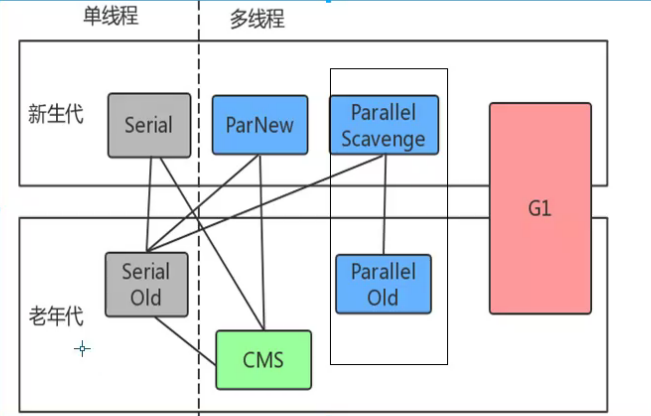

# jvm-study


## 方法执行过程

- jvm申请内存
  
- 初始化运行时数据区
  
  方法区：存放 class；静态变量：常量
  
  堆：实例对象
  
  栈：栈帧（对象的引用，方法）
  
- 类加载
  
- 执行方法
  
- 创建对象
  

## 堆空间分代划分

## outOfMemory异常


```
https://docs.oracle.com/javase/8/docs/technotes/tools/unix/java.html
可以看jvm参数查看网址
```

- [ ] Direct buffer memory ： 直接内存太大（-XX:MaxDirectMemorySize=100m）
  
- [ ] Java heap space： 堆内存溢出 （-Xms30m -Xmx30m -XX:+PrintGCDetails）
  
- [ ] GC overhead limit exceeded： gc占用98%的资源回收效率不足2%的（-Xms30m -Xmx30m）
  
- [ ] Metaspace：方法区异常----（XX:MetaspaceSize=10M -XX:MaxMetaspaceSize=10M）
  

# 常量池（方法区）

1. class常量池
  
  - class的方法
    
  - 字面量（String a = "b"）
    
  - 符合引用，类加载过程中根据符合引用变为直接引用
    
2. 运行时常量池 ---虚拟机规范定义的
  
  直接引用放到运行时常量池
  
3. 字符串常量池
  
  专门针对String的
## 垃圾回收的知识

绝大部分（90%以上）的对象都是朝生夕死，---新生代

熬过多次垃圾回收的对象就越难回收。---老年代


- 复制算法
  

```
特点：
1.实现简单，运行高效；
2.没有内存碎片
3.利用率只有一半
```

- 标记、清楚 整理算法（Mark-Sweep）
  

```
特点
1.位置不连续，产生碎片
2.效率略低
3.两遍扫描
```

# jvm中的垃圾回收器




## Serial/Serial Old

```
最古老的，单线程（串行），只适用于几十兆到一两百兆， 鸡肋
```

## parallel Scavenge/parallel old

```
参数：
useParallelGC:java8默认适用此垃圾回收器； 
maxGCPauseMillis :设置垃圾回收器暂停时间；
useAdaptiveSizePolicy:吞吐量=运行用户代码时间/(运行用户代码时间+垃圾回收时间)


多线程
```

## ParNew/CMS （并发 多线程 专业老年代）


## Garbage First(G1) 化整为零


# class类文件结构


# 类的生命周期


```
加载、验证、准备、初始化、卸载为固定顺序；
解析不一定：java有动态绑定，有可能为初始化后进行；
```

## 加载阶段虚拟机需要完成以下3件事情

1.通过一个类的全限定名来获取定义此类的二进制字节流;2.将这个字节流所代表的静态存储结构转为方法去的运行数据结构；3.在内存中生成一个代表这个类的java.lang.class对象，作为方法区这个类的各种数据的访问入口。

## 校验（-Xverify:none 禁止验证）

1.文件格式校验；2.元数据校验（方法，字段，类）；3.字节码校验；4.符号引用校验

## 准备

静态变量

## 解析

解析阶段是jvm将常量池内的符号引用替换为直接引用的过程

初始化

# 双亲委派的好处

稳定

# 打破双亲委派

Tomcat 自己实现了类加载器，打破了双亲委派

spi jdbc有做这样的处理

# 方法的调用

1. invokestatic（非虚方法）：用来调用静态方法；
  
2. invokespecial（非虚方法）：用于调用私有实例方法、构造器及super关键字等；
  
3. invokevirtual（虚方法）：用于调用飞私有实例方法，比如public和protected，大多数方法调用属于这一中；用final修饰的这种方法也是 --非虚方法；
  
4. invokeinterface（虚方法）：指令用于调用接口方法，它会在运行时搜索一个实现了这个接口方法的对象，找出适合的方法进行调用
  

# 分派

## 静态分派

方法的重载

## 动态分派

方法的重写
